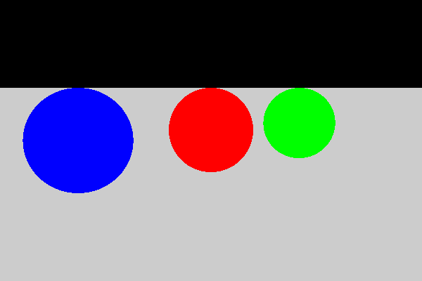
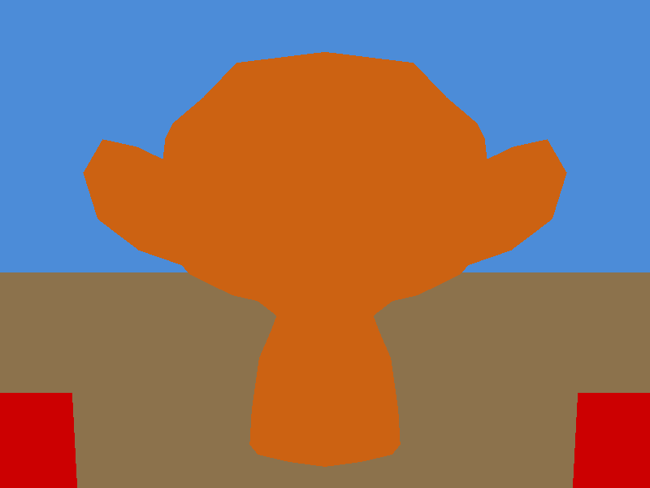
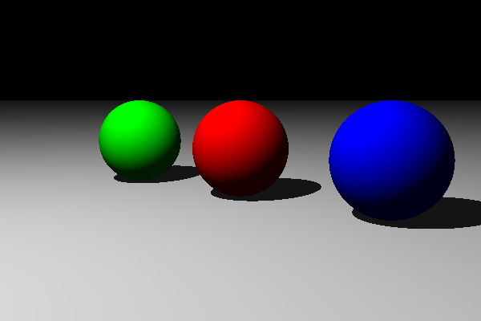

# Ray Tracing — Processamento Gráfico


Um **ray tracer escrito do zero em C++17** para a disciplina de Processamento Gráfico. O projeto evolui
em **4 entregas**, cada uma em sua própria *branch* — do *ray casting* de esferas e planos até a
iluminação recursiva (reflexão/refração) e *soft shadows*. As cenas são descritas em arquivos `.json`,
a saída é uma imagem **PPM** (convertível para PNG), e não há nenhuma dependência externa: o parser de
JSON e o leitor de malhas `.obj` são implementados no próprio repositório.

> A branch **`main`** contém a infraestrutura do projeto e a **Entrega 1**. As features das entregas
> seguintes vivem cada uma em sua branch (veja o [Mapa de branches](#mapa-de-branches)).

---

## Índice

- [Galeria de resultados](#galeria-de-resultados)
- [Como compilar e rodar](#como-compilar-e-rodar)
- [Formato da cena (JSON)](#formato-da-cena-json)
- [Entregas](#entregas)
  - [1. Raycasting com Esferas e Planos](#1-raycasting-com-esferas-e-planos)
  - [2. Raycasting com Malhas de Triângulos](#2-raycasting-com-malhas-de-triângulos)
  - [3. Raytracing não Recursivo (Phong + Sombras)](#3-raytracing-não-recursivo-phong--sombras)
  - [4. Raytracing Recursivo (Reflexão + Refração)](#4-raytracing-recursivo-reflexão--refração)
  - [5. Feature Individual: Soft Shadows](#5-feature-individual-soft-shadows)
- [Mapa de branches](#mapa-de-branches)
- [Estrutura do repositório](#estrutura-do-repositório)
- [Componentes implementados](#componentes-implementados)
- [Referência da API](#referência-da-api)

---

## Galeria de resultados

Cada imagem foi renderizada a partir da branch correspondente da entrega.

<table>
  <tr>
    <td align="center" width="33%"><b>1 · Ray casting</b><br><sub>cor difusa, sem iluminação</sub><br><br></td>
    <td align="center" width="33%"><b>2 · Malhas + transformações</b><br><sub>malha .obj (Suzanne)</sub><br><br></td>
    <td align="center" width="33%"><b>3 · Phong + sombras</b><br><sub>iluminação local + sombras duras</sub><br><br></td>
  </tr>
  <tr>
    <td align="center"><b>4 · Reflexão + refração</b><br><sub>vidro (lei de Snell)</sub><br><br></td>
    <td align="center"><b>5 · Soft shadows</b><br><sub>luz de área, penumbra</sub><br><br></td>
    <td></td>
  </tr>
</table>

---

## Como compilar e rodar

O programa é **header-only**: basta compilar o `main.cpp` (que inclui todo o resto). Funciona em
qualquer branch.

```bash
# 1. Compilar
g++ -std=c++17 -O2 main.cpp -o raytracer

# 2. Renderizar uma cena (a saída PPM vai para o stdout)
./raytracer utils/input/sampleScene.json > saida.ppm

# 3. Converter PPM → PNG (macOS)
sips -s format png saida.ppm --out saida.png
```

> **Requisito:** compilador com suporte a C++17 (`g++ 8+` ou `clang++ 7+`).
> Se a cena não for informada, o programa usa `utils/input/sampleScene.json` por padrão.

**Conversão PPM → PNG** — use a ferramenta que tiver disponível:

| Ferramenta | Comando |
|---|---|
| `sips` (macOS, nativo) | `sips -s format png saida.ppm --out saida.png` |
| ImageMagick | `magick saida.ppm saida.png` (ou `convert ...`) |
| Python + Pillow | `python utils/convert_ppm.py saida.ppm saida.png` |

> Na branch **`main`** há ainda o script **`./render.sh`**, que compila (se necessário), renderiza e
> converte para PNG de uma só vez:
> ```bash
> ./render.sh utils/input/sampleScene.json renders
> ```

---

## Formato da cena (JSON)

Uma cena descreve câmera, luzes, materiais e objetos. Exemplo (esferas coloridas sobre um plano):

```json
{
  "globalLight": [0.1, 0.1, 0.1],

  "materials": {
    "chao":     { "color": [0.8, 0.8, 0.8], "ka": [0.2,0.2,0.2], "ks": [0.3,0.3,0.3], "ns": 10 },
    "vermelho": { "color": [1.0, 0.0, 0.0], "ka": [0.2,0.0,0.0], "ks": [0.5,0.5,0.5], "ns": 32 }
  },

  "camera": {
    "lookfrom": [0, 2, -8],
    "lookat":   [0, 1, 0],
    "upVector": [0, 1, 0],
    "image_width": 600,
    "image_height": 400,
    "screen_distance": 1.0
  },

  "lights": [
    { "name": "principal", "position": [5, 10, -5], "color": [1.0, 1.0, 1.0] }
  ],

  "objects": [
    { "name": "Chao",    "type": "plane",  "point_on_plane": [0,0,0], "normal": [0,1,0], "material": "chao" },
    { "name": "Esfera",  "type": "sphere", "center": [0,1,2], "radius": 1.0, "material": "vermelho" }
  ]
}
```

Campos de material relevantes às entregas: `color` = $k_d$ (difuso), `ka` = ambiente, `ks` = especular,
`ns` = rugosidade $\eta$, `kr` = reflexão, `kt` = transmissão, `ni` = índice de refração (IOR). Materiais
`type: "mesh"` apontam para um arquivo `.obj`.

---

## Entregas

| # | Branch | Tema |
|---|---|---|
| 1 | [`entrega-1`](../../tree/entrega-1) | [Raycasting com esferas e planos](#1-raycasting-com-esferas-e-planos) |
| 2 | [`entrega-2`](../../tree/entrega-2) | [Raycasting com malhas de triângulos](#2-raycasting-com-malhas-de-triângulos) |
| 3 | [`entrega-3`](../../tree/entrega-3) | [Raytracing não recursivo (Phong + sombras)](#3-raytracing-não-recursivo-phong--sombras) |
| 4 | [`entrega-4`](../../tree/entrega-4) | [Raytracing recursivo (reflexão + refração)](#4-raytracing-recursivo-reflexão--refração) |
| 5 | [`feat/soft-shadow`](../../tree/feat/soft-shadow) | [Feature individual: Soft Shadows](#5-feature-individual-soft-shadows) |

---

### 1. Raycasting com Esferas e Planos

> **Branch:** [`entrega-1`](../../tree/entrega-1)

<p align="center"></p>

**O que foi feito.** Câmera móvel com base ortonormal, interseção raio-esfera e raio-plano. Para cada
pixel dispara-se um raio primário e pinta-se com a cor difusa ($k_d$) do objeto mais próximo (ou preto se
não houver interseção). Sem iluminação ainda — daí o aspecto "chapado" das esferas acima.
Arquivos: `src/Camera.h`, `src/Ray.h`, `src/Intersect.h`, `src/Vetor.h`, `src/Ponto.h`.

**Como rodar esta entrega:**

```bash
git switch entrega-1
g++ -std=c++17 -O2 main.cpp -o raytracer
./raytracer utils/input/entrega-1-cenarios/1-tres-esferas.json > saida.ppm
sips -s format png saida.ppm --out saida.png   # macOS
```

#### Tipos para pontos e vetores

O grupo pode usar bibliotecas externas ou expandir os templates `src/Ponto` e `src/Vetor` com as operações necessárias (produto escalar, produto vetorial, normalização, subtração, multiplicação por escalar, etc.).

#### Câmera

A câmera móvel é composta por:

- Ponto de localização no mundo $\small C(c_1, c_2, c_3),\; c_i \in \mathbb{R}$
- Ponto para onde a câmera aponta (centro da tela) $\small M(x, y, z),\; x,y,z \in \mathbb{R}$
- Vetor "para cima" $\small V_{up}(v_1, v_2, v_3),\; V_{up} \neq \vec{0}$
- Três vetores ortonormais $\small W, V, U \in \mathbb{R}^3$ — por convenção, **W** tem a mesma direção que $(M - C)$ mas sentido oposto
- Distância câmera-tela $\small d \in \mathbb{R}_+^*$
- Resolução $\small h_{res}, v_{res} \in \mathbb{Z}_+^*$ (largura e altura em pixels)

> **OBS:** A resolução padrão de pixel é 1×1, ou seja, a tela tem tamanho 1 no mundo e cada pixel mede $\frac{1}{h_{res}}$. O ângulo de visão é consequência direta da resolução e da distância $d$.

Com esses atributos, cada pixel $(i, j)$ mapeia a um ponto na tela por combinação linear dos vetores da base a partir de $C$.

No repositório: `scene.camera` já contém `lookfrom` ($C$), `lookat` ($M$), `up_vector` ($V_{up}$), `screen_distance` ($d$), `image_width` ($h_{res}$), `image_height` ($v_{res}$).

#### Interseções

- **Esfera** — definida por centro $C_\varepsilon(x,y,z)$, raio $r \in \mathbb{R}_+^*$ e cor difusa $O_d \in [0,1]^3$
- **Plano** — definido por ponto $P_p(x,y,z)$, normal $\hat{N}(v_1,v_2,v_3)$ e cor difusa $O_d \in [0,1]^3$

Para renderizar a cena: para cada pixel, dispara-se um raio e retorna-se a cor $k_d$ do objeto mais próximo (ou preto se não houver interseção).

> A cena `sampleScene.json` contém um [Cornell box](https://en.wikipedia.org/wiki/Cornell_box) com 2 esferas e 5 planos.

---

### 2. Raycasting com Malhas de Triângulos

> **Branch:** [`entrega-2`](../../tree/entrega-2)

<p align="center"></p>

**O que foi feito.** Suporte a **malhas de triângulos** carregadas de arquivos `.obj` (interseção
raio-triângulo de **Möller–Trumbore**) e a **transformações afins** — translação, escala e rotação — via
matrizes homogêneas 4×4. Escalas não-uniformes corrigem a normal por $(M^{-1})^\top$. As facetas visíveis
na malha do macaco "Suzanne" acima evidenciam a geometria triangular.
Arquivos: `src/Matrix.h`, `src/Mesh.h`.

**Como rodar esta entrega:**

```bash
git switch entrega-2
g++ -std=c++17 -O2 main.cpp -o raytracer
./raytracer utils/input/entrega-2-cenarios/6-monkey-em-cena.json > saida.ppm
sips -s format png saida.ppm --out saida.png
```

#### Malha de triângulos

Uma malha é definida por:

- $n_\triangle \in \mathbb{N}$ — número de triângulos
- $n_\circ \in \mathbb{N},\; n_\circ \geq 3$ — número de vértices
- Lista de vértices (pontos), tamanho $n_\circ$
- Lista de triplas de índices de vértices (uma por triângulo), tamanho $n_\triangle$
- Lista de normais de triângulos (vetores), tamanho $n_\triangle$
- Lista de normais de vértices — cada uma é a média das normais dos triângulos que compartilham aquele vértice, tamanho $n_\circ$
- Cor difusa $O_d \in [0,1]^3$

A malha é carregada de um arquivo `.obj` — usando o `ObjReader` do repositório.

#### Transformações afins

- Matrizes de floats/doubles (arrays 4×4) aplicáveis a pontos e vetores
- `translation`, `scaling` e `rotation`
- Não há animação; renderizar antes e depois de uma transformação é suficiente

A lista de transformações de cada objeto está em `obj.transforms` — **a ordem importa**.

---

### 3. Raytracing não Recursivo (Phong + Sombras)

> **Branch:** [`entrega-3`](../../tree/entrega-3)

<p align="center"></p>

**O que foi feito.** A cor de cada pixel passa a ser calculada pelo **modelo de iluminação de Phong**
(ambiente + difuso + especular) com **sombras duras**: para cada luz, um raio de sombra verifica se há um
objeto entre o ponto e a fonte. Na imagem acima (a mesma cena da Entrega 1, agora iluminada), note o
sombreamento suave nas esferas, os brilhos especulares e as sombras projetadas no plano.
Arquivo: `src/Phong.h`.

**Como rodar esta entrega:**

```bash
git switch entrega-3
g++ -std=c++17 -O2 main.cpp -o raytracer
./raytracer utils/input/entrega-1-cenarios/1-tres-esferas.json > saida.ppm
sips -s format png saida.ppm --out saida.png
```

Nesta etapa o programa continua fazendo ray-casting, mas ao invés de retornar apenas a cor difusa $k_d$ do objeto atingido, calcula a cor de cada pixel pelo **modelo de iluminação de Phong**, que simula como a luz interage com a superfície. A equação completa é:

$$I = k_a \cdot I_a + \sum_{n=1}^{m} \left[ k_d \cdot (\hat{L}_n \cdot \hat{N}) \cdot I_{L_n} + k_s \cdot (\hat{R}_n \cdot \hat{V})^\eta \cdot I_{L_n} \right] + k_r \cdot I_r + k_t \cdot I_t$$

Nesta entrega os termos $k_r \cdot I_r$ e $k_t \cdot I_t$ (reflexões e refrações) são **ignorados** — eles entram na [Entrega 4](#4-raytracing-recursivo-reflexão--refração).

#### Propriedades de material

Todos os objetos possuem os seguintes coeficientes, todos disponíveis via `obj.material`:

- Coeficiente difuso $\small k_d \in [0, 1]^3$ → `.color`
- Coeficiente especular $\small k_s \in [0, 1]^3$ → `.ks`
- Coeficiente ambiental $\small k_a \in [0, 1]^3$ → `.ka`
- Coeficiente de reflexão $\small k_r \in [0, 1]^3$ → `.kr`
- Coeficiente de transmissão $\small k_t \in [0, 1]^3$ → `.kt`
- Rugosidade $\small \eta > 0$ → `.ns`

#### Fontes de luz

- **Luzes pontuais** — posição $l(x,y,z)$ e intensidade $I_{L_n} \in [0,255]^3$ → `scene.light_list`
- **Luz ambiente** — cor $I_a \in [0,255]^3$ → `scene.global_light.color`

#### Vetores do modelo de Phong

Para calcular a equação em cada ponto de interseção $P$ constroem-se os seguintes vetores (todos normalizados):

- $\hat{N}$ — normal à superfície em $P$ (para esfera: $P - C_\varepsilon$; para plano: normal do plano; para malha: interpolada a partir das normais dos vértices)
- $\hat{L}_n$ — de $P$ até a posição da luz $n$: $\;\hat{L}_n = \text{normalize}(l_n - P)$
- $\hat{R}_n$ — reflexão de $-\hat{L}_n$ em relação a $\hat{N}$: $\;\hat{R}_n = 2(\hat{L}_n \cdot \hat{N})\hat{N} - \hat{L}_n$
- $\hat{V}$ — de $P$ até o observador; para raios primários é a câmera ($\hat{V} = \text{normalize}(C - P)$); muda para raios secundários
- $I_r \in [0,255]^3$ — cor retornada pelo raio refletido (entrega 4)
- $I_t \in [0,255]^3$ — cor retornada pelo raio refratado (entrega 4)

#### Sombras

Para cada luz $n$, antes de somar sua contribuição ao pixel, verifica-se se o ponto $P$ está em sombra em relação a ela:

1. Constrói-se um **raio de sombra** com origem em $P$ (ligeiramente deslocado ao longo de $\hat{N}$ para evitar auto-interseção) e direção $\hat{L}_n$
2. Testa-se interseção desse raio com todos os objetos da cena
3. Se houver alguma interseção com $t \in (0,\, |l_n - P|)$ — ou seja, um objeto entre $P$ e a luz — a contribuição de $I_{L_n}$ é **ignorada** para aquele pixel

O resultado é que superfícies bloqueadas por outros objetos ficam na sombra, enquanto as iluminadas diretamente recebem a contribuição difusa e especular normalmente.

---

### 4. Raytracing Recursivo (Reflexão + Refração)

> **Branch:** [`entrega-4`](../../tree/entrega-4)

<p align="center"></p>

**O que foi feito.** A iluminação ganha os termos **recursivos** $k_r \cdot I_r$ (reflexão) e
$k_t \cdot I_t$ (refração pela lei de Snell, usando o IOR `material.ni`, com tratamento de **reflexão
total interna**), limitados por uma profundidade máxima de recursão. Na imagem, a esfera de vidro central
(IOR ≈ 1,52) **refrata e inverte** as esferas vermelha e azul que estão atrás dela.
Arquivo: `src/Phong.h` (estendido com `reflect` e `refract`).

**Como rodar esta entrega:**

```bash
git switch entrega-4
g++ -std=c++17 -O2 main.cpp -o raytracer
./raytracer utils/input/apresentacao-entrega-4/testcase2.json > saida.ppm
sips -s format png saida.ppm --out saida.png
```

Esta etapa adiciona a iluminação recursiva (reflexões e refrações) ao modelo de Phong:

- **IOR dos objetos** — $\text{IOR} \in \mathbb{R},\; \text{IOR} \geq 1$ → `obj.material.ni`. Considera-se IOR do ar = 1.
- **Reflexão** — para todo objeto com propriedades reflexivas ($k_r > 0$), dispara-se um raio secundário refletido e soma-se $k_r \cdot I_r$ ao resultado de Phong.
- **Refração** — para todo objeto transparente ($k_t > 0$), calcula-se a direção refratada via lei de Snell usando `material.ni` e soma-se $k_t \cdot I_t$.
- **Limite de recursão** — uma profundidade máxima evita recursão infinita.

Como o ray-tracer já sabe fazer ray-casting, basta uma chamada recursiva a partir dos pontos de interseção com objetos reflexivos ou transparentes, somando a cor secundária ao resultado de Phong.

---

### 5. Feature Individual: Soft Shadows

> **Branch:** [`feat/soft-shadow`](../../tree/feat/soft-shadow)

<p align="center"></p>

**O que foi feito.** Implementação de **soft shadows** (sombras suaves). A fonte de luz deixa de ser um
ponto e passa a ter área (campo `radius` no JSON): ela é amostrada por uma grade de **8×8 = 64 pontos**, e
a fração de amostras visíveis define a intensidade da sombra. O resultado é a **penumbra** — a transição
suave entre luz e sombra visível na borda do disco escuro abaixo da esfera. Com `radius ≤ 0` o
comportamento volta a ser o de sombras duras da Entrega 3.
Arquivo: `src/Phong.h` (estendido com amostragem de luz de área).

**Como rodar esta entrega:**

```bash
git switch feat/soft-shadow
g++ -std=c++17 -O2 main.cpp -o raytracer
./raytracer utils/input/soft-shadow-demo.json > saida.ppm
sips -s format png saida.ppm --out saida.png
```

> Soft shadows é uma das **features individuais** possíveis no projeto. Outras opções (cada aluno escolhe
> **uma**, e integrantes do mesmo grupo não podem repetir):
>
> | Dificuldade | Exemplos |
> | --- | --- |
> | **Fácil** | Anti-aliasing (supersampling), cones e cilindros, paraboloide, textura em planos/esferas, textura procedural, tone mapping, bump mapping |
> | **Média** | **Soft shadows** *(implementada)*, toro como malha de triângulos, textura sólida, iluminação de raios paralelos (luz solar por uma janela) |
> | **Difícil** | Superfície de Bézier, superfície de revolução, octree, relief mapping, BSP |

---

## Mapa de branches

| Branch | Entrega | O que adiciona |
|---|---|---|
| [`main`](../../tree/main) | base + E1 | Infraestrutura + ray casting (esferas/planos) |
| [`entrega-1`](../../tree/entrega-1) | 1 | `Camera.h`, `Ray.h`, `Intersect.h` (esfera + plano) |
| [`entrega-2`](../../tree/entrega-2) | 2 | `Matrix.h` (transformações 4×4), `Mesh.h` (Möller–Trumbore) |
| [`entrega-3`](../../tree/entrega-3) | 3 | `Phong.h` (iluminação de Phong + sombras duras) |
| [`entrega-4`](../../tree/entrega-4) | 4 | `Phong.h` recursivo (reflexão + refração) |
| [`feat/soft-shadow`](../../tree/feat/soft-shadow) | 5 | `Phong.h` com luz de área (soft shadows) |

> Cada entrega é incremental sobre a anterior e mantém compatibilidade: com `kr = kt = 0` a Entrega 4 se
> comporta como a 3; com `radius ≤ 0` o soft shadow vira sombra dura.

---

## Estrutura do repositório

Estrutura na branch `main` (Entrega 1). As branches seguintes acrescentam `src/Matrix.h`, `src/Mesh.h`
(Entrega 2), `src/Phong.h` (Entregas 3–4 e soft-shadow) e uma pasta `tests/`.

```text
ray_tracing_projeto_pg/
├── main.cpp                 ← ponto de entrada: lê a cena, cria a câmera, percorre os pixels e escreve o PPM
├── render.sh / .bat / .ps1  ← scripts: compila + renderiza + converte para PNG
├── README.md
│
├── src/
│   ├── Camera.h             ← câmera + geração de raios primários (base ortonormal)
│   ├── Intersect.h          ← interseção raio-esfera e raio-plano
│   ├── Ray.h                ← raio paramétrico P(t) = O + t·D
│   ├── Ponto.h              ← ponto 3D
│   └── Vetor.h              ← vetor 3D (dot, cross, normalize, magnitude)
│
├── utils/                   ← infraestrutura pronta
│   ├── Scene/               ← parser de cena JSON (sceneParser, jsonParser, sceneSchema)
│   ├── MeshReader/          ← leitor de malhas .obj (ObjReader) e materiais .mtl (Colormap)
│   ├── input/               ← cenas .json e malhas .obj
│   │   ├── sampleScene.json / mirrorScene.json / monkeyScene.json
│   │   ├── entrega-1-cenarios/   ← cenas de teste da entrega 1
│   │   └── estudo/               ← cenas de estudo (câmera, cores, zoom)
│   └── convert_ppm.py       ← utilitário PPM → PNG (Pillow)
│
├── assets/                  ← imagens de referência deste README (uma por entrega)
└── renders/                 ← saída das renderizações (PPM/PNG)
```

---

## Componentes implementados

| Componente | Onde | Entrega |
|---|---|---|
| Parser de cena (`.json`) | `utils/Scene/` | infra |
| Leitor de malhas (`.obj` / `.mtl`) | `utils/MeshReader/` | infra |
| Câmera móvel + base ortonormal | `src/Camera.h` | 1 |
| Interseção raio-esfera / raio-plano | `src/Intersect.h` | 1 |
| Interseção raio-triângulo (Möller–Trumbore) | `src/Mesh.h` | 2 |
| Transformações afins (matriz 4×4) | `src/Matrix.h` | 2 |
| Iluminação de Phong + sombras duras | `src/Phong.h` | 3 |
| Reflexão e refração (recursivo) | `src/Phong.h` | 4 |
| Soft shadows (luz de área) | `src/Phong.h` | 5 |

---

## Referência da API

O parser lê um arquivo `.json` e devolve um objeto `SceneData` com os dados de câmera, luzes e objetos.

**C++:**

```cpp
#include "utils/Scene/sceneParser.cpp"

SceneData scene = SceneJsonLoader::loadFile("utils/input/sampleScene.json");

scene.camera.lookfrom        // Ponto
scene.camera.lookat          // Ponto
scene.camera.upVector        // Vetor
scene.camera.screen_distance // double
scene.camera.image_width     // int
scene.camera.image_height    // int

for (auto& obj : scene.objects) {
    obj.objType              // string: "sphere", "plane", "mesh"
    obj.relativePos          // Ponto
    obj.material.color       // ColorData — kd
    obj.material.ks          // ColorData
    obj.material.ka          // ColorData
    obj.material.ns          // double — brilho
    obj.material.ni          // double — IOR

    obj.getNum("radius")     // double
    obj.getVetor("normal")   // Vetor
    obj.getPonto("center")   // Ponto
    obj.getProperty("path")  // string — caminho do .obj (mesh)
}
```

**Python** (parser equivalente):

```python
from utils.Scene.sceneParser import SceneJsonLoader

scene = SceneJsonLoader.load_file("utils/input/sampleScene.json")
print(scene.camera.lookfrom)        # Ponto — posição da câmera
for obj in scene.objects:
    print(obj.obj_type)             # "sphere" | "plane" | "mesh"
    print(obj.material.color)       # ColorData — kd (difuso)
for light in scene.light_list:
    print(light.pos, light.color)   # posição e cor/intensidade
print(scene.global_light.color)     # luz ambiente
```

### Lendo uma malha `.obj`

```cpp
#include "utils/MeshReader/ObjReader.cpp"

objReader mesh("utils/input/cubo.obj");
mesh.getFacePoints()  // vector<vector<Ponto>> — 3 pontos por face
mesh.getNormals()     // vector<Vetor>
mesh.getVertices()    // vector<Ponto>
```

```python
from utils.MeshReader.ObjReader import ObjReader

mesh = ObjReader("utils/input/cubo.obj")
mesh.get_face_points()   # list[list[Ponto]] — 3 pontos por face
mesh.get_normals()       # list[Vetor]
mesh.get_vertices()      # list[Ponto]
mesh.get_faces()         # list[FaceData] — índices + material por face
```
