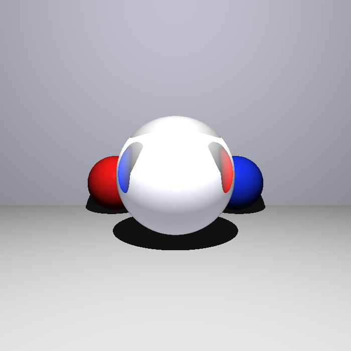

# Entrega 4 — Raytracing Recursivo (Reflexão + Refração)


> Parte do projeto **[Ray Tracing — Processamento Gráfico](../../tree/main)**.
> Esta branch (`entrega-4`) implementa a **quarta entrega**: iluminação recursiva — reflexão e refração.

<p align="center"></p>

## O que foi feito

A iluminação ganha os termos **recursivos** $k_r \cdot I_r$ (reflexão) e $k_t \cdot I_t$ (refração pela
lei de Snell, usando o IOR `material.ni`, com tratamento de **reflexão total interna**), limitados por uma
profundidade máxima de recursão. Na imagem, a esfera de vidro central (IOR ≈ 1,52) **refrata e inverte**
as esferas vermelha e azul que estão atrás dela.

Arquivo principal: `src/Phong.h`, estendido com as funções `reflect` e `refract` e a chamada recursiva.

## Como rodar

```bash
# já nesta branch (entrega-4)
g++ -std=c++17 -O2 main.cpp -o raytracer
./raytracer utils/input/apresentacao-entrega-4/testcase2.json > saida.ppm
sips -s format png saida.ppm --out saida.png   # macOS (ou ImageMagick / utils/convert_ppm.py)
```

> `testcase2.json` traz uma esfera de vidro (refração); `testcase3.json` traz um material tipo diamante
> (IOR ≈ 2,42) que evidencia a reflexão total interna; `mirrorScene.json` demonstra um espelho ($k_r$).

## Detalhes técnicos

Esta etapa adiciona a iluminação recursiva (reflexões e refrações) ao modelo de Phong da
[Entrega 3](../../tree/entrega-3):

$$I = k_a \cdot I_a + \sum_{n=1}^{m} \left[ k_d \cdot (\hat{L}_n \cdot \hat{N}) \cdot I_{L_n} + k_s \cdot (\hat{R}_n \cdot \hat{V})^\eta \cdot I_{L_n} \right] + k_r \cdot I_r + k_t \cdot I_t$$

- **IOR dos objetos** — $\text{IOR} \in \mathbb{R},\; \text{IOR} \geq 1$ → `obj.material.ni`. Considera-se IOR do ar = 1.
- **Reflexão** — para todo objeto reflexivo ($k_r > 0$), dispara-se um raio secundário refletido e soma-se $k_r \cdot I_r$ ao resultado de Phong.
- **Refração** — para todo objeto transparente ($k_t > 0$), calcula-se a direção refratada via lei de Snell usando `material.ni` e soma-se $k_t \cdot I_t$. Quando $\sin^2\theta_t > 1$ ocorre **reflexão total interna**.
- **Limite de recursão** — uma profundidade máxima evita recursão infinita.

Como o ray-tracer já sabe fazer ray-casting, basta uma chamada recursiva a partir dos pontos de
interseção com objetos reflexivos ou transparentes, somando a cor secundária ao resultado de Phong.

---

### Entregas do projeto

- [Entrega 1 — Esferas e planos](../../tree/entrega-1)
- [Entrega 2 — Malhas de triângulos](../../tree/entrega-2)
- [Entrega 3 — Phong + sombras](../../tree/entrega-3)
- **Entrega 4 — Reflexão + refração** ← *você está aqui*
- [Feature individual — Soft shadows](../../tree/feat/soft-shadow)
- [Visão geral do projeto (main)](../../tree/main)
