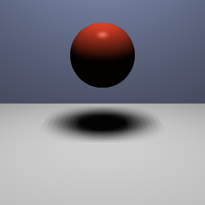

# Feature Individual — Soft Shadows


> Parte do projeto **[Ray Tracing — Processamento Gráfico](../../tree/main)**.
> Esta branch (`feat/soft-shadow`) implementa a **feature individual**: sombras suaves (*soft shadows*),
> construída sobre a [Entrega 4](../../tree/entrega-4).

<p align="center"></p>

## O que foi feito

Implementação de **soft shadows** (sombras suaves). A fonte de luz deixa de ser um ponto e passa a ter
área (campo `radius` no JSON): ela é amostrada por uma grade de **8×8 = 64 pontos**, e a fração de
amostras visíveis define a intensidade da sombra em cada ponto. O resultado é a **penumbra** — a
transição suave entre luz e sombra, visível na borda do disco escuro abaixo da esfera. Com `radius ≤ 0` o
comportamento volta a ser o de sombras duras da [Entrega 3](../../tree/entrega-3).

Arquivo principal: `src/Phong.h`, estendido com a amostragem de luz de área.

## Como rodar

```bash
# já nesta branch (feat/soft-shadow)
g++ -std=c++17 -O2 main.cpp -o raytracer
./raytracer utils/input/soft-shadow-demo.json > saida.ppm
sips -s format png saida.ppm --out saida.png   # macOS (ou ImageMagick / utils/convert_ppm.py)
```

> A pasta `renders/` traz comparações lado a lado (`sem-soft-shadow/` × `com-soft-shadow/`) das mesmas
> cenas, evidenciando a penumbra.

## Detalhes técnicos

- A luz extensa é modelada como um **painel quadrado** no plano da fonte; o campo `radius` define seu tamanho.
- Para cada ponto de interseção $P$, amostra-se a fonte em uma grade $k \times k$ (padrão $k = 8 \Rightarrow 64$ amostras).
- A **visibilidade** é a razão `amostras_visíveis / amostras_totais` $\in [0,1]$, multiplicando a contribuição difusa daquela luz.
- Bordas totalmente bloqueadas → sombra (umbra); parcialmente bloqueadas → **penumbra**; totalmente visíveis → luz plena.
- Fallback: `radius ≤ 0` reproduz exatamente a sombra dura (1 amostra), mantendo compatibilidade com as entregas anteriores.

> **Soft shadows** é uma das *features individuais* possíveis no projeto. Outras opções:
>
> | Dificuldade | Exemplos |
> | --- | --- |
> | **Fácil** | Anti-aliasing, cones/cilindros, paraboloide, textura em planos/esferas, textura procedural, tone mapping, bump mapping |
> | **Média** | **Soft shadows** *(esta)*, toro como malha, textura sólida, raios paralelos (luz solar por janela) |
> | **Difícil** | Superfície de Bézier, superfície de revolução, octree, relief mapping, BSP |

---

### Entregas do projeto

- [Entrega 1 — Esferas e planos](../../tree/entrega-1)
- [Entrega 2 — Malhas de triângulos](../../tree/entrega-2)
- [Entrega 3 — Phong + sombras](../../tree/entrega-3)
- [Entrega 4 — Reflexão + refração](../../tree/entrega-4)
- **Feature individual — Soft shadows** ← *você está aqui*
- [Visão geral do projeto (main)](../../tree/main)
