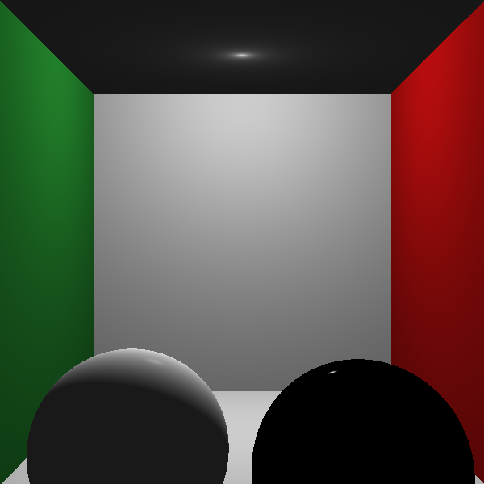

# Entrega 3 — Raytracing não Recursivo (Phong + Sombras)


> Parte do projeto **[Ray Tracing — Processamento Gráfico](../../tree/main)**.
> Esta branch (`entrega-3`) implementa a **terceira entrega**: iluminação de Phong com sombras duras.

<p align="center"></p>

## O que foi feito

A cor de cada pixel passa a ser calculada pelo **modelo de iluminação de Phong** (ambiente + difuso +
especular) com **sombras duras**: para cada luz, um raio de sombra verifica se há um objeto entre o ponto
e a fonte. Na imagem acima (a mesma cena das três esferas da Entrega 1, agora iluminada) note o
sombreamento suave nas esferas, os brilhos especulares e as sombras projetadas no plano.

Arquivo principal: `src/Phong.h` (modelo de iluminação local + sombras).

## Como rodar

```bash
# já nesta branch (entrega-3)
g++ -std=c++17 -O2 main.cpp -o raytracer
./raytracer utils/input/entrega-1-cenarios/1-tres-esferas.json > saida.ppm
sips -s format png saida.ppm --out saida.png   # macOS (ou ImageMagick / utils/convert_ppm.py)
```

> Experimente também `utils/input/sampleScene.json` (Cornell box) para ver Phong + sombras numa cena fechada.

## Detalhes técnicos

O programa continua fazendo ray-casting, mas ao invés de retornar apenas a cor difusa $k_d$ do objeto
atingido, calcula a cor de cada pixel pelo **modelo de iluminação de Phong**. A equação completa é:

$$I = k_a \cdot I_a + \sum_{n=1}^{m} \left[ k_d \cdot (\hat{L}_n \cdot \hat{N}) \cdot I_{L_n} + k_s \cdot (\hat{R}_n \cdot \hat{V})^\eta \cdot I_{L_n} \right] + k_r \cdot I_r + k_t \cdot I_t$$

Nesta entrega os termos $k_r \cdot I_r$ e $k_t \cdot I_t$ (reflexões e refrações) são **ignorados** — eles
entram na [Entrega 4](../../tree/entrega-4).

### Propriedades de material

Todos disponíveis via `obj.material`:

- Coeficiente difuso $\small k_d \in [0, 1]^3$ → `.color`
- Coeficiente especular $\small k_s \in [0, 1]^3$ → `.ks`
- Coeficiente ambiental $\small k_a \in [0, 1]^3$ → `.ka`
- Coeficiente de reflexão $\small k_r \in [0, 1]^3$ → `.kr`
- Coeficiente de transmissão $\small k_t \in [0, 1]^3$ → `.kt`
- Rugosidade $\small \eta > 0$ → `.ns`

### Fontes de luz

- **Luzes pontuais** — posição $l(x,y,z)$ e intensidade $I_{L_n} \in [0,255]^3$ → `scene.light_list`
- **Luz ambiente** — cor $I_a \in [0,255]^3$ → `scene.global_light.color`

### Vetores do modelo de Phong

Em cada ponto de interseção $P$ (todos normalizados):

- $\hat{N}$ — normal à superfície em $P$ (esfera: $P - C_\varepsilon$; plano: normal do plano; malha: interpolada das normais dos vértices)
- $\hat{L}_n$ — de $P$ até a luz $n$: $\;\hat{L}_n = \text{normalize}(l_n - P)$
- $\hat{R}_n$ — reflexão de $-\hat{L}_n$ em relação a $\hat{N}$: $\;\hat{R}_n = 2(\hat{L}_n \cdot \hat{N})\hat{N} - \hat{L}_n$
- $\hat{V}$ — de $P$ até o observador ($\hat{V} = \text{normalize}(C - P)$ para raios primários)

### Sombras

Para cada luz $n$, antes de somar sua contribuição:

1. Constrói-se um **raio de sombra** com origem em $P$ (deslocado ao longo de $\hat{N}$ para evitar auto-interseção) e direção $\hat{L}_n$
2. Testa-se interseção com todos os objetos da cena
3. Se houver interseção com $t \in (0,\, |l_n - P|)$ — um objeto entre $P$ e a luz — a contribuição de $I_{L_n}$ é **ignorada** para aquele pixel

Superfícies bloqueadas por outros objetos ficam na sombra; as iluminadas diretamente recebem a
contribuição difusa e especular normalmente.

---

### Entregas do projeto

- [Entrega 1 — Esferas e planos](../../tree/entrega-1)
- [Entrega 2 — Malhas de triângulos](../../tree/entrega-2)
- **Entrega 3 — Phong + sombras** ← *você está aqui*
- [Entrega 4 — Reflexão + refração](../../tree/entrega-4)
- [Feature individual — Soft shadows](../../tree/feat/soft-shadow)
- [Visão geral do projeto (main)](../../tree/main)
